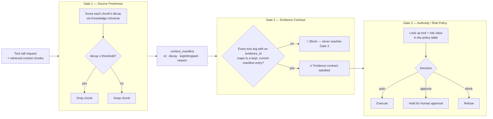

# context-tool-gate

A tiny reference implementation of a three-gate safety pipeline for LLM tool
calls:

**Source freshness → Evidence contract → Authority/risk policy**

This exists to answer one question cleanly: *if an agent is about to call a
tool, what has to be true before that's allowed to happen?* Rather than one
layer trying to judge everything at once, this splits the problem into three
narrow, independently-testable gates — each one only responsible for a single
failure mode.

> **This is a demo, not a production service.** It's deliberately small —
> read it in one sitting, then replace each gate's logic with your own rules.

## The three-gate model



| Gate | Question it answers | What it checks | What it does NOT do |
|---|---|---|---|
| **1 — Source freshness** | Is the context current enough to reason over at all? | Sends each retrieved chunk to the [Knowledge Universe](https://knowledgeuniverse.tech) API, gets back a decay score, drops anything at or above the configured threshold. Emits a `context_manifest`: id, decay score, kept/dropped, reason. | Doesn't look at the tool call itself — this runs before the model reasons over the context. |
| **2 — Evidence contract** | Does the tool call's payload actually rest on evidence that survived Gate 1? | A deterministic, boring check: every argument that claims to come from retrieved context has an `evidence_id`; every `evidence_id` exists in the manifest and is marked `kept`. No ID, no execution. | Doesn't judge whether the evidence is *sufficient* for the decision — that's a risk question, not a shape question. |
| **3 — Authority / risk policy** | Is this specific action, for this tool, allowed to run automatically? | A small policy table: tool → risk class → `auto` / `approve` / `block`. | Doesn't re-check freshness or evidence — by the time a call reaches Gate 3, Gates 1 and 2 already passed. |

The point of splitting it this way: stale context, missing evidence, and
unauthorized action are three different failure modes. A single layer trying
to catch all three ends up either too strict or too loose. Each gate here
only has to be right about one thing.

## Quick start

```bash
git clone https://github.com/VLSiddarth/context-tool-gate.git
cd context-tool-gate
python -m venv .venv
.\.venv\Scripts\Activate    # or: source .venv/bin/activate
pip install -r requirements.txt
python demo.py
```

`requirements.txt` pulls Gate 1's freshness client straight from
[KU-Gateway](https://github.com/VLSiddarth/KU-Gateway) on GitHub — no local
paths, no manual `pip install -e`.

Before running, set your Knowledge Universe API key:

```bash
cp .env.example .env
# then edit .env:
#   KU_API_KEY=ku_test_your_key_here
```

## What you'll see

`demo.py` runs two scenarios back to back. A genuinely stale chunk gets
caught at Gate 1 and the call never reaches Gate 3:

```
Scenario: Stale Context – Expected Gate 2 BLOCK
Gate 1 – Source Freshness
  Total chunks: 1   Kept: 0   Dropped: 1   Threshold: 0.01
  chunk_0_...   decay 0.67   DROPPED   decay_score 0.67 ≥ threshold 0.01

Gate 2 – Evidence Contract
  🛑 Evidence id 'chunk_0_...' is stale (kept=False) and cannot be used.
Execution blocked by Gate 2.
```

A fresh chunk clears both gates, and Gate 3 makes the final call based on
the tool's own risk class:

```
Scenario: Fresh Context – Expected ALL PASS
Gate 1 – Source Freshness
  Total chunks: 1   Kept: 1   Dropped: 0   Threshold: 0.5
  chunk_0_...   decay 0.23   KEPT

Gate 2 – Evidence Contract
  ✅ All evidence present, fresh, and no conflicts.

Gate 3 – Authority / Risk Policy
  Tool: send_email   Decision: auto
  Tool 'send_email' classified as low risk. Decision: auto.
```

## Testing without spending real API calls

The demo can run against a mock Knowledge Universe API instead of the live
one — useful for forcing specific decay scores to see both the block and
pass paths on demand. Point `.env` at the mock:

```ini
KU_API_URL=http://localhost:8001
```

Then run the mock server (bundled with KU-Gateway) and `demo.py` in separate
terminals:

```bash
uvicorn mock_ku_api:app --port 8001
```

The mock returns varied decay scores per call, so re-running `demo.py` a few
times will surface both the block and the all-pass path. Check the exact
path to `mock_ku_api.py` in your KU-Gateway checkout — it may differ from
`tests/integration/` depending on which version you have installed.

## Extending Gate 2 and Gate 3

Both are intentionally boring so they're easy to replace:

- **Gate 2** only checks *shape*: does every evidence-backed argument point
  at a manifest entry marked `kept`? Extending it means adding more
  deterministic, machine-checkable facts — e.g. "does the referenced ID
  belong to the caller's allowed scope," "does a write action have an
  attached diff/dry-run" — not adding judgment calls. Judgment calls belong
  in Gate 3 or a human approval step, not here.
- **Gate 3** is a flat policy table: `(tool, risk_class) → decision`.
  Extending it means adding rows, or keying the lookup on more context (actor,
  account scope, blast radius) — the table stays a lookup, not a model call.

## What this is not

- Not a production service — no auth, no persistence, no retries.
- Not a general-purpose guardrails framework — it's one opinionated split of
  responsibilities, meant to be forked and cut down further.
- Gate 1's freshness scoring is only as good as the underlying decay model —
  see [KU-Gateway](https://github.com/VLSiddarth/KU-Gateway) for how that
  works and its own documented limitations.

## Related

- [KU-Gateway](https://github.com/VLSiddarth/KU-Gateway) — the Gate 1
  freshness proxy this project depends on.
- [Background write-up on the freshness problem](https://dev.to/vlsiddarth/i-built-a-localhost-proxy-that-stops-langchain-from-hallucinating-on-dead-rag-data-and-cuts-token-371n)